## Funky Banners (An IntelliJ Plugin for Spring Boot Applications)

Enhance your Spring Boot development experience with visually appealing startup banners.
Choose from predefined themes or create your own custom theme to make your Spring Boot application stand out.

### Previews

Dark Theme Preview:

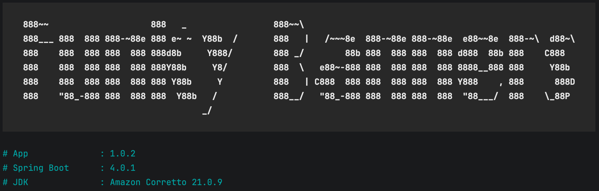
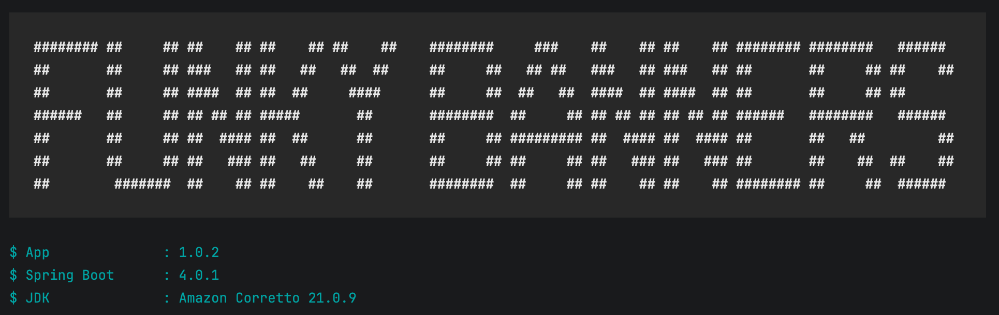
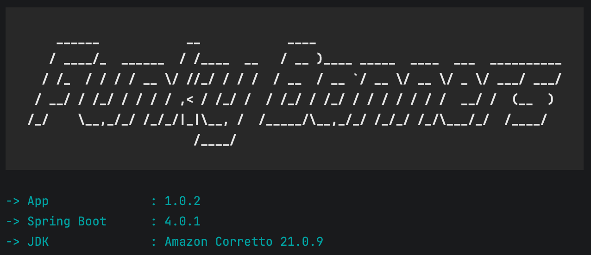

Light Theme Preview:

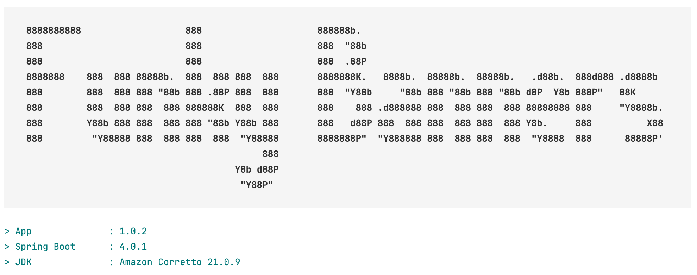
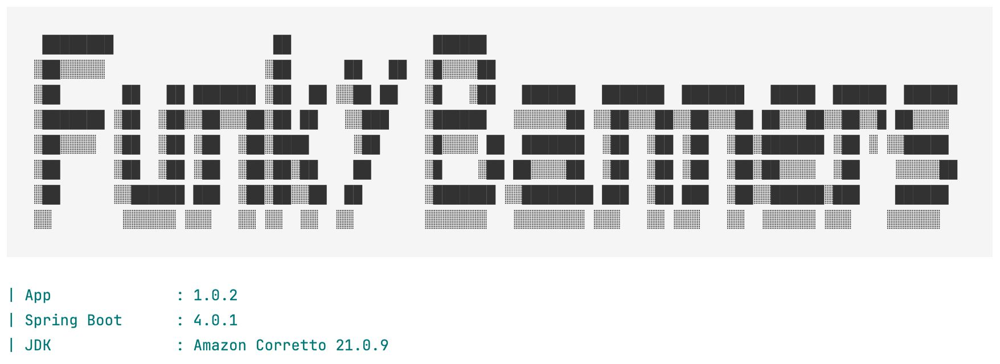
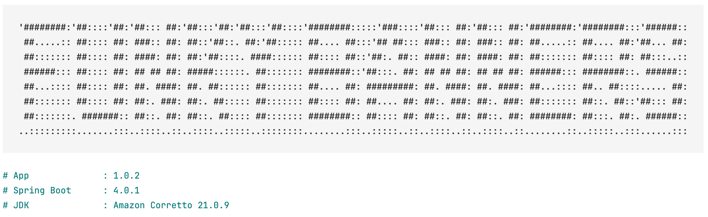
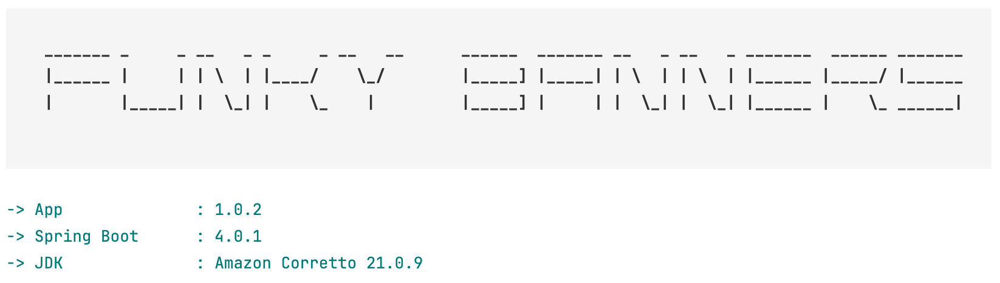

Surprise Me:

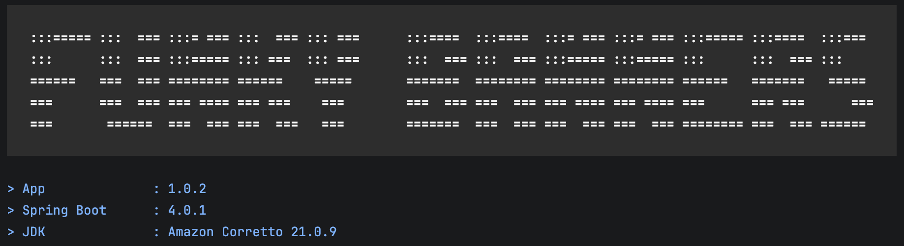
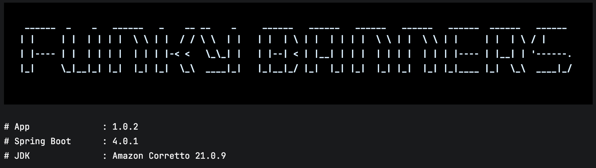
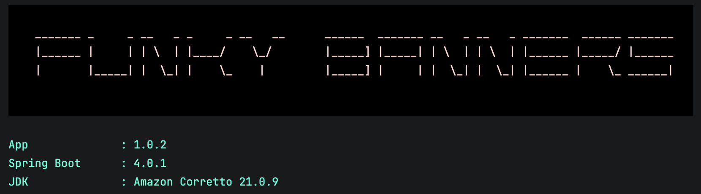
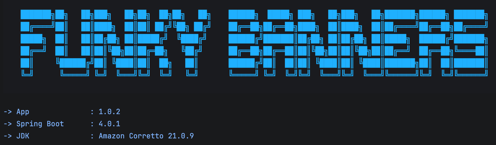
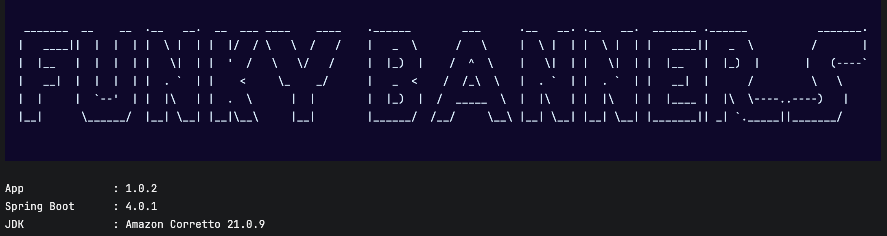
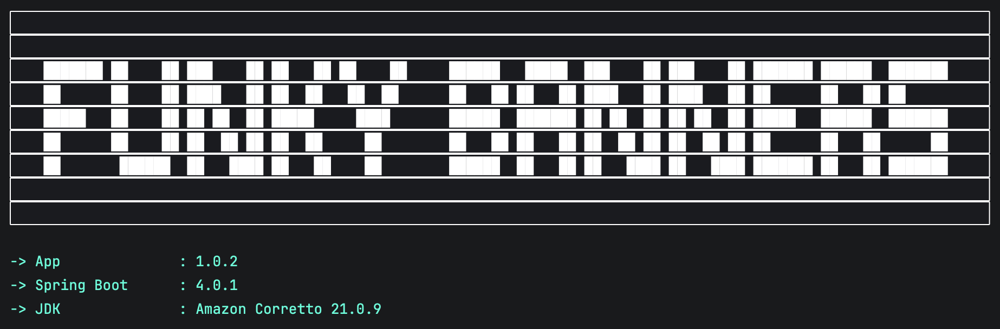
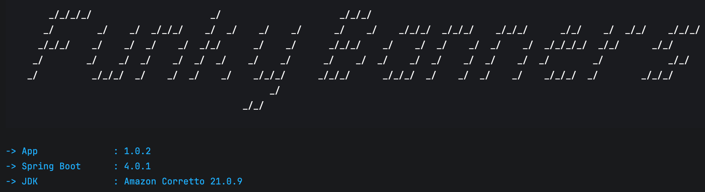
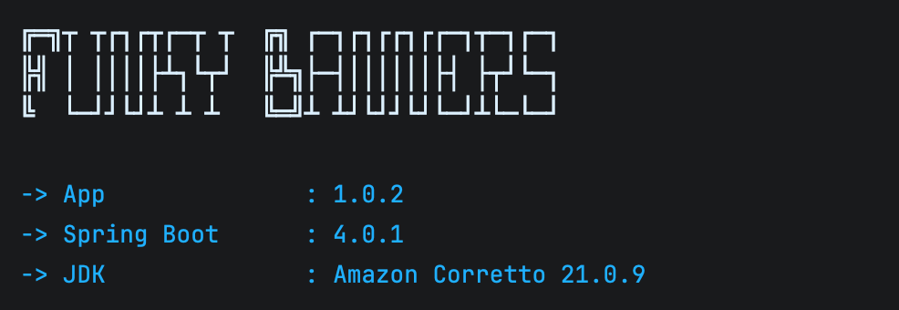
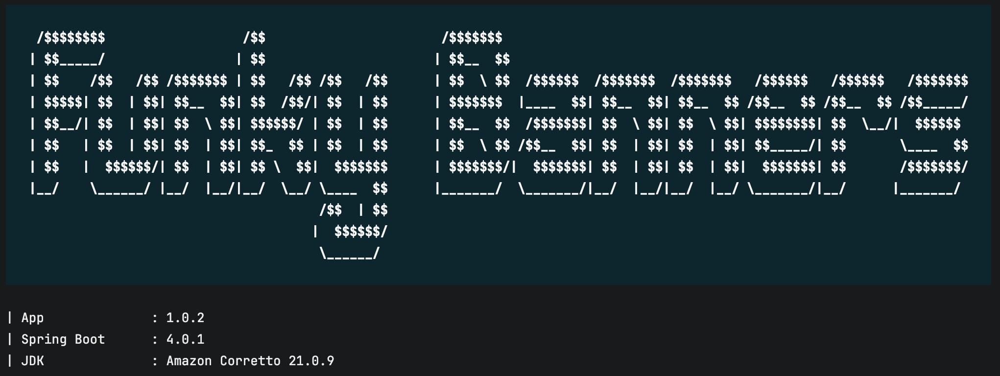
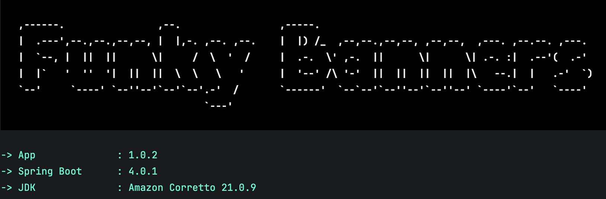
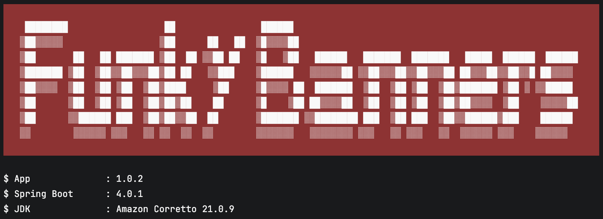
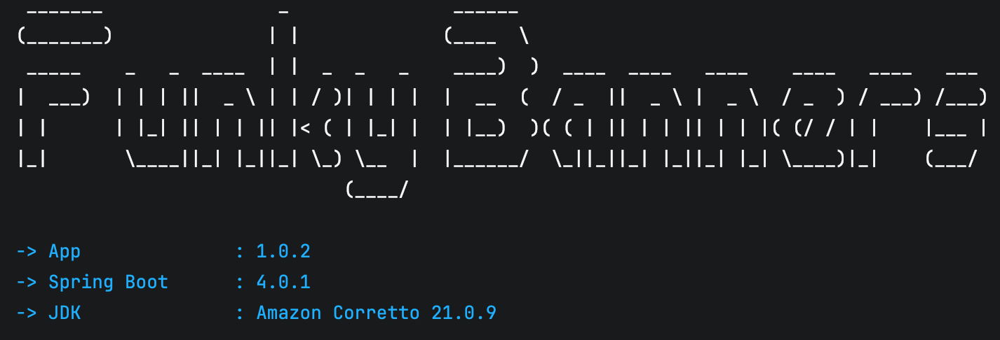

### Features

- Seamless integration with existing Spring Boot projects 
- Choose from light or dark theme to match your IDE's global theme 
- Let the plugin surprise you with randomized theme "Surprise Me" 
- Customize the banner to your heart's content using Custom theme 
- Ability to override global theme settings at individual project level 
- Caption underneath banner lists SpringBoot and JDK versions 

### Usage Notes

- Running the application from terminal will NOT reflect the banner changes as the plugin depends on IDE's internal build system
- Project root must have a mavel/gradle build file. 
- If you are using gradle, make sure to enable Build and run using IntelliJ under 'Settings->Build->Build Tools->Gradle' 

- If you choose to Build and run using Gradle instead of IntelliJ, then consider using the [Spring Banner Gradle Plugin](https://github.com/bhuyanp/spring-banner-gradle-plugin) to generate custom banners
- Recommended Console Font Line Height: 1.0 for better appearance 

### Credits

- [Figlet](http://www.figlet.org)
- [JFiglet](https://github.com/dtmo/jfiglet)
- Colorizer by [JColor](https://github.com/dialex/jcolor)

### Love Funky Banners?

Please consider supporting our efforts.

