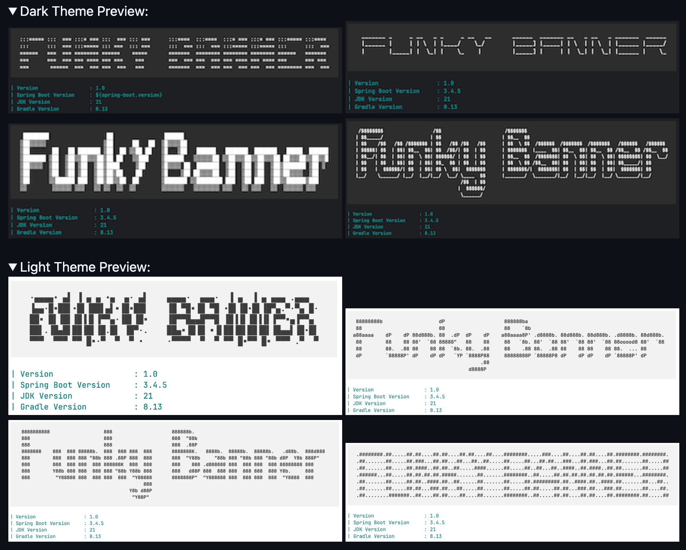
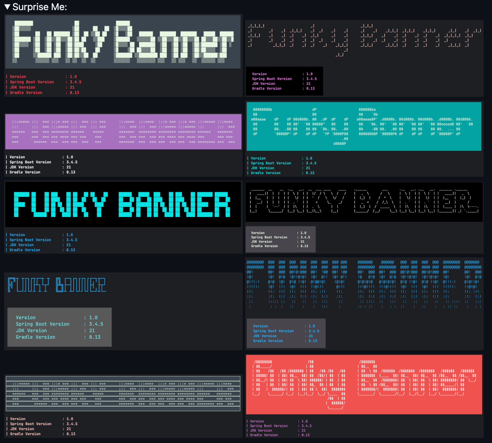
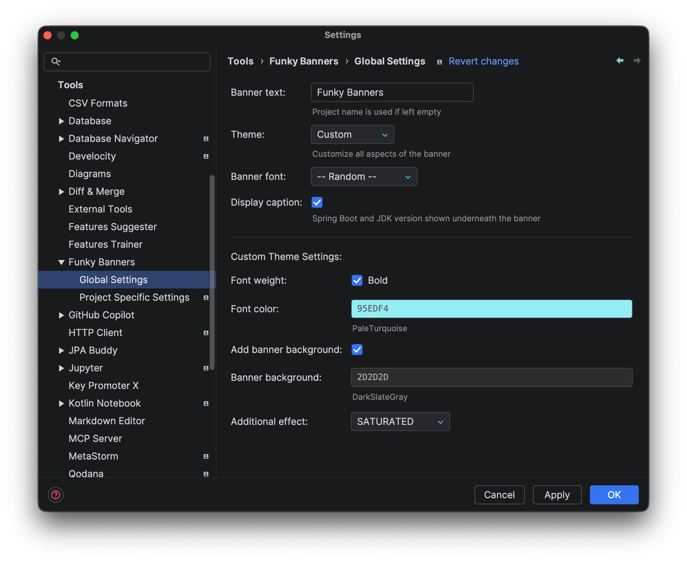
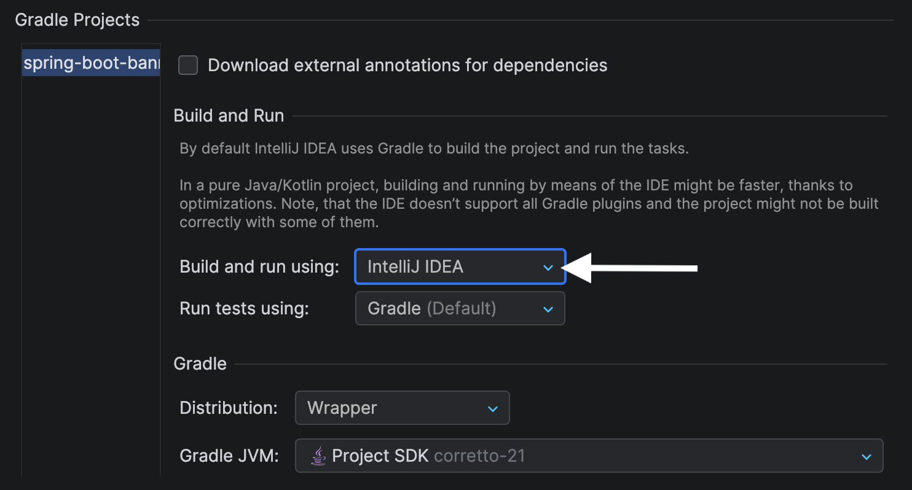

## Funky Banners (An IntelliJ Plugin for Spring Boot Applications)

Enhance your Spring Boot development experience with visually appealing startup banners.
Choose from predefined themes or create your own custom theme to make your Spring Boot application stand out.

#### [Support the project](https://buymeacoffee.com/bhuyanp)

<iframe width="245px" height="48px" src="https://plugins.jetbrains.com/embeddable/install/29672"></iframe>

### Previews

### Features

- Seamless integration with existing Spring Boot projects
- Choose from light or dark theme to match your IDE's global theme
- Let the plugin surprise you with a sensible and randomized theme "Surprise Me"
- Customize the banner to your heart's content using Custom theme.

### Usage Notes

- Running the application from terminal will NOT reflect the banner changes as the plugin depends on IDE's internal build system
- If you are using gradle, make sure to enable Build and run using IntelliJ under 'Settings->Build->Build Tools->Gradle'
- If you choose to Build and run using Gradle instead of IntelliJ, then consider using the [Spring Banner Gradle Plugin](https://github.com/bhuyanp/spring-banner-gradle-plugin) to generate custom banners

### Credits

- Colorizer by [JColor](https://github.com/dialex/jcolor)
- Figlet fonts used:  [FIGlet](https://www.figlet.org/examples.html)
